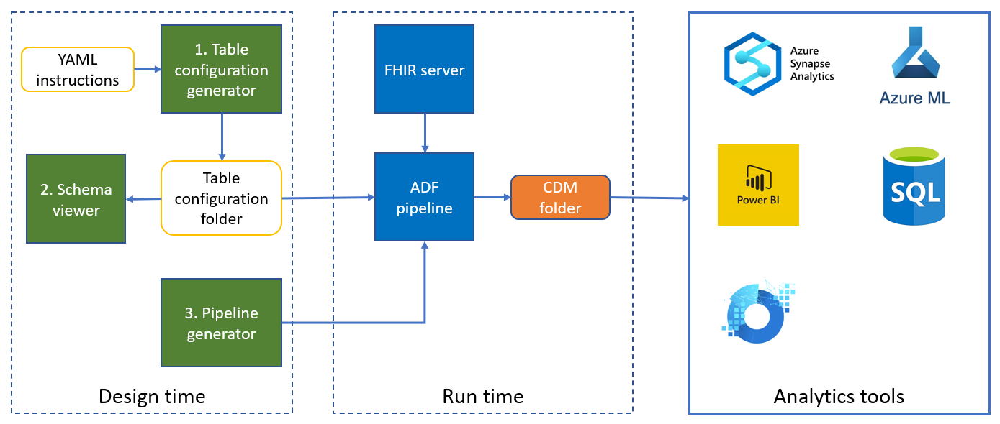
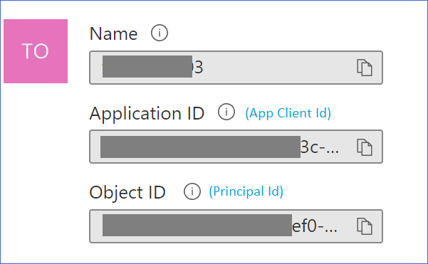
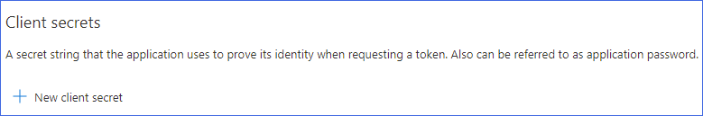
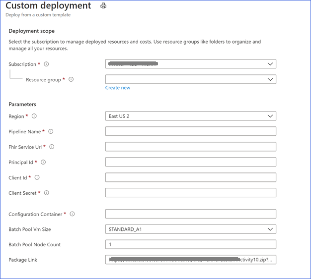

# FHIR to CDM tool

FHIR to CDM tool can be used to create an ADF pipeline to export data from a FHIR server, rectangularize it based on user configurations, and move it to a [CDM folder](https://docs.microsoft.com/en-us/common-data-model/data-lake) in Azure Data Lake Storage Gen 2. 

A CDM folder is a folder in a data lake that conforms to specific, well-defined, and standardized metadata structures and self-describing data. These folders facilitate metadata discovery and interoperability between data producers and data consumers. 

FHIR to CDM pipeline acts as a data producer. Azure Synapse, Power BI, Azure Data Factory, Azure Databricks, Azure Machine Learning etc. act as data consumers in this scenario.

The FHIR to CDM tool has three components, shown in green in the diagram below:



## 1. Table configuration generator

Table configuration generator takes YAML instructions from user and generates a table configuration folder. The schema viewer, described later, helps visualize the schema of the generated tables.

First, ensure you already have Node.js and npm installed, see [Downloading and installing Node.js and npm](https://docs.npmjs.com/downloading-and-installing-node-js-and-npm) if they don't exist

Then clone this [FHIR-Analytics-Pipelines](https://github.com/microsoft/FHIR-Analytics-Pipelines) repo to your local machine, browse to the ```FhirToCdm\Configuration-Generator``` directory, use command below to install the dependencies. 
```
npm ci
```

Subsequently, you can run the following command from the _Configuration-Generator_ folder to generate table configuration. You may use the sample yaml files, [_resourcesConfig.yml_](../Configuration-Generator/resourcesConfig.yml) and [_propertiesGroupConfig.yml_](../Configuration-Generator/propertiesGroupConfig.yml) provided in the project. See the [YAML instructions format](yaml-instructions-format.md) document if you want to write yaml instructions as per your needs.

```
Configuration-Generator> node .\generate_from_yaml.js -r {resource configuration file} -p {properties group file} -o {output folder}
```

Example: 

```Configuration-Generator> node .\generate_from_yaml.js -r resourcesConfig.yml -p propertiesGroupConfig.yml -o tableConfig```

| Option | Name | Optionality | Default | Description
| ------- | ---- |----------- |----------- |----------- |
| -r | resourcesConfigFile | Optional | resourcesConfig.yml | Name of the input resource configuration file |
| -p | propertiesConfigFile  | Optional | propertiesGroupConfig.yml | Name of the input propertiesGroup file |
| -o | output | Required |  | The output folder to which the configuration will be generated |
| -h | Help | Optional | | Shows help |

## 2. Schema viewer

The table configuration folder contains metadata describing the structure of tables, and processing instructions for converting FHIR data to those tables. You can use the Schema Viewer tool to see the schema of a given table.

```Configuration-Generator> node .\program.js show-schema -d {output folder} -t {Table Name} -maxDepth 4```

Example:

```Configuration-Generator> node .\program.js show-schema -d tableConfig -t Patient -maxDepth 4```

| Option | Name | Optionality | Default | Description
| ------- | ---- |----------- |----------- |----------- |
| -h | help | Optional | | Shows help |
| -t | tableName | Required | | Name of the table to show its schema. Table name may be different from the file name: PatientAddress instead of Patient_Address. |
| -d | destination | Required | | Name of the configuration folder |
| -maxDepth | maxDepth | Optional | 3 | Max recursion depth to travel in the configuration file |

## 3. Pipeline generator

Pipeline generator uses the content of Table configuration folder, and a few other configurations to generate an ADF pipeline. This ADF pipeline, when triggered, exports the data from the FHIR server using $export API, rectangularizes it, and write to a CDM folder along with associated CDM metadata.

Use the following steps to create FHIR to CDM pipeline

### 3.1. Ensure that $export is enabled on Azure API for FHIR
Follow [FHIR export configuration](https://docs.microsoft.com/en-us/azure/healthcare-apis/fhir/configure-export-data) document to enable $export on your FHIR server if needed.

### 3.2. Create an Azure AD application and service principal.
The ADF pipeline uses an Azure batch service to do the transformation. We need to register an Azure AD application for the batch service. Follow the [documentation](https://docs.microsoft.com/en-us/azure/active-directory/develop/howto-create-service-principal-portal) to create an AAD application and service principal.

Note the service principle id and client id for the application by navigating to Azure Portal => Azure Active Directory => Enterprise applications => your app. 




Create a client secret by navigating to Azure Portal => Azure Active Directory => App Registrations => your app => Certificates & secrets => New client secret. Take note of the client secret.



### 3.3. Grant access of export storage location to the service principal
In the Access Control of the export storage grant _Storage Blob Data Contributor_ role to the Azure AD application created above. 

### 3.4. Deploy egress pipeline

Use the button below to deploy egress pipeline through the Azure Portal.
   
<a href="https://portal.azure.com/#create/Microsoft.Template/uri/https%3A%2F%2Fraw.githubusercontent.com%2FMicrosoft%2FFHIR-Analytics-Pipelines%2Fmain%2FFhirToCdm%2FTemplates%2FfhirServiceToCdm.json" target="_blank">
    
</a>

Or you can download and save the [fhirServiceToCdm.json](https://github.com/microsoft/FHIR-Analytics-Pipelines/tree/main/FhirToCdm/Templates/fhirServiceToCdm.json) deployment template. Use this template to do a [custom deployment](https://ms.portal.azure.com/#create/Microsoft.Template) on Azure.



| Parameter | Description | Example |
| ------- | ---- |----------- |
| Region | The Azure region where the ADF pipeline will be deployed| East US 2|
| Pipeline Name | Name of the ADF Pipeline to be created. | fhir2cdm (Keep the length less than 17 characters) |
| FHIR service url | Base URL of the FHIR server from where the data will be exported| https://myfhirserver.azurehealthcareapis.com|
| Principal Id | The service principal id of the application created in step 2|aa1decb5-7c11-4000-916b-ac7abd4f135b|
| Client Id | The client id from step 2|cafa1d08-b71c-42b2-8fb7-61e6790f241f|
| Client Secret |The client secret from step 2|7A6-89_BpM1d7.P34H_StR_fKKa_uTJjbU|
| Configuration Container | The name of container on the storage account where you want to keep table configurations. | myconfigcontainer|
| Batch Pool VM Size |Size of the VM to use for Azure batch|STANDARD_A1|
| Batch Pool Node Count |Number of nodes in the Batch Pool. Different resource types can be processed in parallel using this pool|3|
| Package Link | The link to the binary used for transformation| (Do not change this value) |

It will create the the following Azure resources:
1. An ADF pipeline with the name _{pipelinename}-df_.
2. A key vault with the name _{pipelinename}-kv_ to store the client secret.
3. A batch account with the name _{pipelinename}batch_ to run the transformation.
4. A storage account with the name _{pipelinename}storage_. This storage will be used for different purposes such as running the batch job and the destination storage for the CDM data. This is also where you will keep the table configuration.

### 3.5. Grant access of the FHIR service to the Azure Data Factory
In the access control of the FHIR service grant _FHIR data exporter_ & _FHIR data reader_ role to the data factory, _{pipelinename}-df_, created in the previous step. 

### 3.6. Upload the table configurations to the blob container
Upload the content of the table configuration folder to the configuration container that you specified in Step 4. The rectangularization behavior of the pipeline is goverened by the content of this folder. You can update the content of this folder to change the rectangularization behavior.

### 3.7. Trigger the ADF pipeline
Go to the  _{pipelinename}-df_, and trigger the pipeline. One the pipeline execution is completed, you should see the exported data in the CDM folder on the storage account _{pipelinename}storage_. You should see one folder for each table having a csv file.

### Troubleshooting the pipeline
In case the pipeline run is successful, but you do not see data in the CDM folder, go to the _adfjobs_ container within _{pipelinename}storage_ account, look for the latest run-folder, which has a GUID name, and see the _stderr.txt_ file for details.

## 4. FHIR to CDM local tool
We provide a local tool to convert FHIR data to CDM, it also uses the content in table configuration folder to generate CDM metadata, and then convert input FHIR ndjson data to CDM.

You need to build the ```Microsoft.Health.Fhir.Transformation.Cdm.Tool``` project, then call the _Microsoft.Health.Fhir.Transformation.Cdm.Tool.exe_ like:

```./Microsoft.Health.Fhir.Transformation.Cdm.Tool.exe --config {Table config folder} --input {Input folder that contains FHIR ndjson data} --output {CDM output folder}```


| Option | Optionality | Default | Description
| ------- |----------- |----------- |----------- |
| --config | Required | | Name of the table configuration folder |
| --input |  Required | | Name of the input folder contains FHIR ndjson data |
| --output | Required | | Name of the CDM output folder |
| --maxDepth | Optional | 3 | Max recursion depth to generate CDM |

## Next Steps
Once you have the data in a CDM folder, it can be consumed by several Microsoft services such as Synapse Analytics, ADF, Azure Databricks, Azure Machine Learning, Azure SQL, and Power BI. See the [instructions](cdm-to-synapse.md) for moving the data from a CDM folder to Synapse analytics.