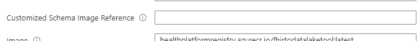

# Customized Schema

When using the FhirToDatalake pipeline, **"Customized Schema"** enable users to sync up FHIR data with user-defined schema.

You need to prepare the customized schemas, push them to Container Registry, then give the image reference when deploying the pipeline.




## Prepare the customized schema files
For each resource types, E.g. Patient, Observation, you need to prepare a **liquid template** and a related **JSON schema** file if you want to sync up them to datalake with customized schema. 


- The [liquid template](https://shopify.github.io/liquid/). Be used to convert the raw FHIR JSON data into target structure.
- The [JSON schema file](https://json-schema.org/). Be used to generate the Parquet schema and create table definitions.

We leverage the [FHIR-Converter](https://github.com/microsoft/FHIR-Converter) to convert the data based on customized schema files, you can find more information on its repository.

The FHIR-Converter project contains a [Template Managenment CLI](FHIR-Converter) tool to managed the liquid templates on the Container Registry, which can be used to push customized schema to ACR as an image.

### Customized Schema Basic Example

Below are the example liquid template and JSON schema for "Patient" resource, flatten the [Patient birthPlace](https://build.fhir.org/extension-patient-birthplace.html) extension property for analytics.

_FHIR Patient data:_
```Javascript
// Example FHIR Patient data
{
	"resourceType": "Patient",
	"id": "Example-Patient",
    ...
}

```

_Liquid template: **Patient.liquid**_
```liquid

{
    "resourceType": "{{ msg.resourceType }}",
    "id": "{{ msg.id }}"
}


```

_JSON schema file: **Patient.schema.json**_

```javascript
{
    "title": "Patient customized schema",
    "type": "object",
    "properties": {
        "resourceType": { "type": "string" },
        "id": { "type": "string" }
    },
    "required": [ "id" ]
}
```

### Customized Schema Example For Patient BirthPlace Extension 

Below are the example liquid template and JSON schema for "Patient" resource, flatten the [Patient birthPlace](https://build.fhir.org/extension-patient-birthplace.html) extension property for analytics.

_birthPlace section in FHIR Patient data:_
```Javascript
{
	"resourceType": "Patient",
	"id": "Example-Patient-With-BirthPlace",
    ...
    "extension": [
    {
        "url": "http://hl7.org/fhir/StructureDefinition/patient-birthPlace",
        "valueAddress": {
            "city": "PleasantVille",
            "district": "Rainbow",
            "state": "Vic",
            "line": [
                "534 Erewhon St"
            ],
            "postalCode": "3999"
        }
    }
	]
}

```

_Liquid template: **Patient.liquid**_
```liquid

{
    "resourceType": "{{ msg.resourceType }}",
    "id": "{{ msg.id }}",

    
    "birthPlaceExtension.valueAddress.city": "{{ birth_place_extension.valueAddress.city }}",
    "birthPlaceExtension.valueAddress.state": "{{ birth_place_extension.valueAddress.state }}",
    "birthPlaceExtension.valueAddress.country": "{{ birth_place_extension.valueAddress.country }}",
    "birthPlaceExtension.valueAddress.postalCode": "{{ birth_place_extension.valueAddress.postalCode }}",
}


```

_JSON schema file: **Patient.schema.json**_

```javascript
{
    "title": "Patient customized schema",
    "type": "object",
    "properties": {
        "resourceType": { "type": "string" },
        "id": { "type": "string" },
        "birthPlaceExtension.valueAddress.city": { "type": "string" },
        "birthPlaceExtension.valueAddress.state": { "type": "string" },
        "birthPlaceExtension.valueAddress.country": { "type": "string" },
        "birthPlaceExtension.valueAddress.postalCode": { "type": "string" }
    },
    "required": [ "id" ]
}
```

**Note**:
1. The JSON schema files must be saved at **Schema** directory in the image.
	 
	 

2. The JSON schema files need to have suffix **".schema.json"**.

3. The liquid templates and JSON schema files name should be aligned with resource type name. 
   
    E.g. "```Patient.schema.json```" and "```Patient.liquid```" be used to process the "Patient" resource.

4. The "validate" tag in template is optional and we recommend using it in your liquid template.
5. We internally leverage the [FHIR-Converter](https://github.com/microsoft/FHIR-Converter) to convert the raw FHIR data. You can test your templates and schema files with it before deploying the analytics pipeline.

## Push customized schema files to Container Registry as an image

The FhirToDatalake pipeline takes an image reference as a parameter for customized schema configs, users need to push their customized schemas to Azure Container Registry as an image, and give the pipeline image reference to preform the customized schema sync up.

### Prerequisites
Install [docker](https://docs.docker.com/engine/install/) and start it on running environment.

### Use Template Management CLI to push customized schemas to ACR.
We command to use [Template Management CLI](https://github.com/microsoft/FHIR-Converter/blob/main/docs/TemplateManagementCLI.md#using-template-management-cli) tool in FHIR-Converter project to push the customized schema files to Azure Container Registry as an image.

You can find the detailed steps on it document.
Here are some quick commands guidance.

```Powershell
# Login using Azure CLI
az login
az acr login --name <acrName>

# Push the customized schema directory to Container Registry
.\Microsoft.Health.Fhir.Liquid.Converter.Tool.exe push <acrName>.azurecr.io/templatetest:default {Customized Schema Folder Path}
```


