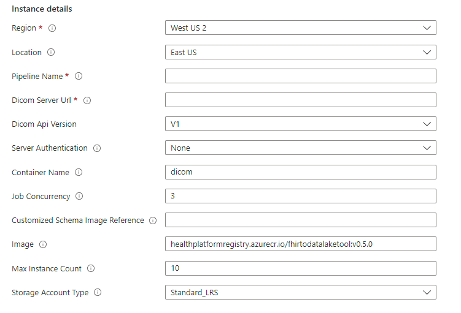
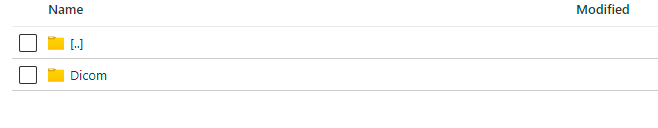
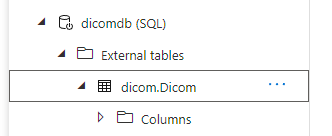

# DICOM to Synapse Sync Agent

DICOM to Synapse Sync Agent enables you to perform Analytics and Machine Learning on DICOM metadata by moving DICOM metadata to Azure Data Lake in near real time and making it available to a Synapse workspace.

It is an [Azure Container App](https://learn.microsoft.com/en-us/azure/container-apps/?ocid=AID3042118) that extracts data from a DICOM server using DICOM [Search](https://learn.microsoft.com/en-us/azure/healthcare-apis/dicom/dicom-services-conformance-statement#search-qido-rs) APIs, converts it to hierarchical Parquet files, and writes it to Azure Data Lake in near real time. This solution also contains a script to create External Table in Synapse Serverless SQL pool pointing to the DICOM Parquet files. For more information about External Tables and Views.

This solution enables you to query against the entire DICOM metadata with tools such as Synapse Studio, SSMS, and Power BI. You can also access the Parquet files directly from a Synapse Spark pool. You should consider this solution if you want to access all of your DICOM metadata in near real time, and want to defer custom transformation to downstream systems.

**Note**: An API usage charge will be incurred in the DICOM server if you use this tool to copy data from the DICOM server to Azure Data Lake.

## Deployment

### Prerequisites

- An instance of DICOM server, or the DICOM service in Azure Healthcare APIs. The pipeline will sync data from this DICOM server.
- A Synapse workspace.

### Steps at high level

1. Deploy the pipeline to [Azure Container App](https://learn.microsoft.com/en-us/azure/container-apps/?ocid=AID3042118) using the given ARM template.
1. Provide access of the DICOM service to the Container App that was deployed in the previous step.
1. Verify that the data gets copied to the Storage Account. If data is copied to the Storage Account, then the pipeline is working successfully.
1. Provide access of the Storage Account and the Synapse workspace to your account for running the PowerScript mentioned below.
1. Provide access of the Storage Account to the Synapse Workspace to access the data from Synapse.
1. Run the provided PowerShell script that creates following artifacts:
    1. Dicom specific folder in the Azure Storage Account.
    1. A database in Synapse serverless pool with External Table pointing to the DICOM Parquet files in the Storage Account.
1. Query data from Synapse Studio.

### 1. Deploy the pipeline

1. To deploy the DICOM to datalake sync pipeline, use the button below to deploy through the Azure Portal.
   
    <a href="https://portal.azure.com/#create/Microsoft.Template/uri/https%3A%2F%2Fraw.githubusercontent.com%2FMicrosoft%2FFHIR-Analytics-Pipelines%2Fmain%2FFhirToDataLake%2Fdeploy%2Ftemplates%2FContainerApp%2FDeployDicomPipelineToContainerApp.json" target="_blank">
        
    </a>

    Or you can browse to the [Custom deployment](https://ms.portal.Azure.com/#create/Microsoft.Template) page in the Azure portal, select **Build your own template in the editor**, then copy the content of the provided [ARM template](../deploy/templates/ContainerApp/DeployDicomPipelineToContainerApp.json) to the edit box and click **Save**.

    The deployment page should open the following form. 
    
    

2. Fill the form based on the table below and click on **Review and Create** to start the deployment.

    |Parameter   | Description   |
    |---|---|
    | Resource Group | Name of the resource group where you want the pipeline related resources to be created. |
    | Location | The location to deploy the DicomToDatalake pipeline. |
    | Pipeline Name  | A name for the DicomToDatalake pipeline, need to be unique in your subscription.  |
    | Dicom Server Url  | The URL of the DICOM server. If the baseUri has relative parts (like http://www.example.org/r4), then the relative part must be terminated with a slash, (like http://www.example.org/r4/). |
    | Dicom Api Version | Version of the DICOM server. Currently only R4 is supported. |
    | Server Authentication  | The authentication method to access the DICOM server. |
    | Container Name | A name for the Storage Account container to which Parquet files will be written. The Storage Account with autogenerated name will automatically be created during the installation. You need not change this. |
    | Job Concurrency | Concurrent jobs exeucting in parallel. |
    | Customized Schema Image Reference | The customized schema image reference for the image on Container Registry. Refer [TemplateManagement](https://github.com/microsoft/FHIR-Converter/blob/main/docs/TemplateManagementCLI.md) for how to manage your template images. |
    | Image | DicomToDatalake container image to deploy. You need not change this. |
    | Max Instance Count | Maximum number of replicas running for pipeline Container App. |
    | Storage Account type | Azure Storage Account type to deploy. |

3. Ensure to make note of the names of the _Storage Account_ and the _Azure Container Apps_ created during the deployment.

### 2. Provide Access of the DICOM server to the Azure Container App

If you are using the DICOM service in Azure Healthcare APIs, assign the **DICOM Data Reader** role to the Azure Container App deployed above.

If you are using the DICOM server for Azure with anonymous access, then you can skip this step.

### 3. Verify data movement

The Azure Container App runs automatically. You'll notice the progress of the Azure Container App in the Azure portal. The time taken to write the data to the storage account depends on the amount of metadata in the DICOM server. After the Azure Container App execution is completed, you should have Parquet files in the Storage Account. Browse to the _results_ folder inside the container. You should see a folder corresponding to Dicom resource.



### 4. Provide privilege to your account

You must provide the following roles to your account to run the PowerShell script in the next step. You may revoke these roles after the installation is complete.

1. In your Synapse workspace, select **Synapse Studio > Manage > Access Control**, and then provide the _Synapse Administrator_ role to your account.
1. In the Storage Account created during the pipeline installation, select the **Access Control (IAM)** and assign the _Storage Blob Data Contributor_ role to your account.

### 5. Provide access of the Storage Account to the Synapse Workspace

To enable Synapse to read the data from the Storage Account, assign the _Storage Blob Data Contributor_ role to it. You can do this by selecting **Managed identify** while adding members to the role. You should be able to pick your Synapse workspace instance from the list of managed identities shown on the portal.

### 6. Run the PowerShell script

Running the PowerShell script that creates following artifacts:

1. Dicom specific folder in the Azure Storage Account.
1. A database in Synapse [serverless SQL pool](https://docs.microsoft.com/en-us/azure/synapse-analytics/sql/on-demand-workspace-overview) with [External Tables](https://docs.microsoft.com/en-us/azure/synapse-analytics/sql/develop-tables-external-tables?tabs=hadoop) pointing to the DICOM metadata Parquet files in the Storage Account.

To run the PowerShell Script, perform the following steps:

1. Clone this [FHIR-Analytics-Pipelines](https://github.com/microsoft/FHIR-Analytics-Pipelines) repo to your local machine.
1. Open the PowerShell console, ensure that you have the latest version of the **PowerShell 7** or **Powershell 5.1**.
1. Install Powershell [Az](https://docs.microsoft.com/en-us/powershell/azure/install-az-ps?view=azps-7.1.0) and separated [Az.Synapse](https://docs.microsoft.com/en-us/cli/azure/synapse?view=azure-cli-latest) modules if they don't exist.
    ``` PowerShell
    Install-Module -Name Az
    Install-Module -Name Az.Synapse
    ```
1. Install Powershell [SqlServer](https://learn.microsoft.com/en-us/sql/powershell/download-sql-server-ps-module?view=sql-server-ver16) module if it doesn't exist.
    ``` PowerShell
    Install-Module -Name SqlServer
    ```
1. Sign in to your Azure account to the subscription where synapse is located.
    ``` PowerShell
    Connect-AzAccount -SubscriptionId 'yyyy-yyyy-yyyy-yyyy'
    ```
1. Browse to the scripts folder under this path (..\FhirToDataLake\scripts).
1. Run the following PowerShell script. 
    ```Powershell
    ./Set-SynapseEnvironment.ps1 -SynapseWorkspaceName "{Name of your Synapse workspace instance}" -StorageName "{Name of your storage account where Parquet files are written}" -Container dicom -Database dicomdb -DataSourceType DICOM
    ```
    For more details, refer to the complete syntax in [Set-SynapseEnvironment Syntax](./SetSynapseEnvironmentSyntax.md).


### 7. Query data from Synapse Studio

Go to your Synapse workspace serverless SQL pool. You should see a new database named _dicomdb_. Expand _External Tables_ to see the entities. Your DICOM Parquet format metadata is now ready to be queried.



As you add more data to the DICOM server, it will be fetched automatically to the Data Lake and become available for querying. 
