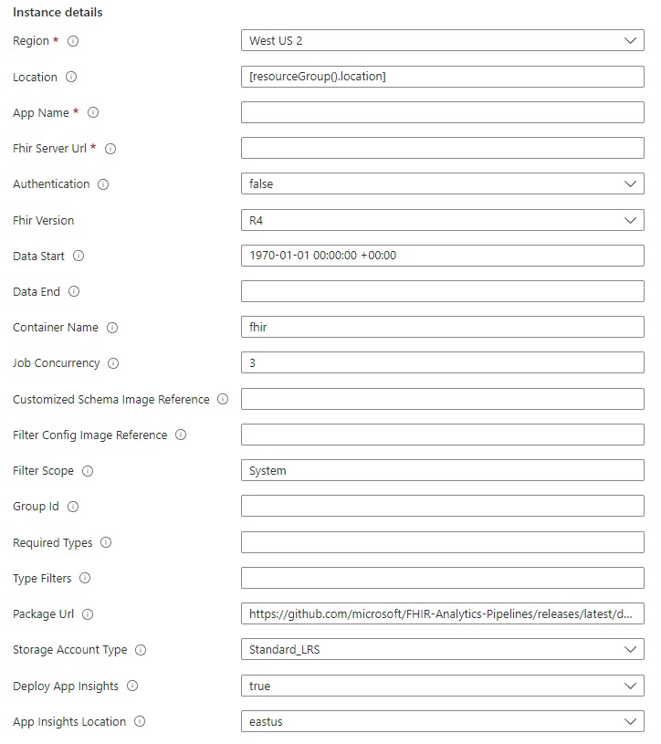

# Deployment FhirToDatalake To Azure Function

1. To deploy the FHIR Synapse sync pipeline to [Azure Function](https://learn.microsoft.com/en-us/azure/azure-functions/functions-overview), use the buttons below to deploy through the Azure Portal.
   
    

    Or you can browse to the [Custom deployment](https://ms.portal.Azure.com/#create/Microsoft.Template) page in the Azure portal, select **Build your own template in the editor**, then copy the content of the provided [ARM template](../deploy/templates/Function/DeployFhirPipelineToFunction.json) to the edit box and click **Save**.

    The deployment page should open the following form. 
    
    

1. Fill the form based on the table below and click on **Review and Create** to start the deployment.

    |Parameter   | Description   |
    |---|---|
    | Resource Group | Name of the resource group where you want the pipeline related resources to be created. |
    | Location | The location to deploy the FhirToDatalake pipeline. |
    | App Name  | A name for the Azure Function.  |
    | Fhir Server Url  | The URL of the FHIR server. If the baseUri has relative parts (like http://www.example.org/r4), then the relative part must be terminated with a slash, (like http://www.example.org/r4/). |
    | Authentication  |  Whether to access the FHIR server with managed identity authentication. Set it to false if you are using an instance of the FHIR server for Azure with public access. |
    | Fhir Version | Version of the FHIR server. Currently only R4 is supported. |
    | Data Start | Start time stamp of the data to be exported. |
    | Data End | Start time stamp of the data to be exported. Leave it empty if you want to periodically export data in real time.  |
    | Container Name | A name for the Storage Account container to which Parquet files will be written. The Storage Account with autogenerated name will automatically be created during the installation. |
    | Job Concurrency | Concurrent jobs exeucting in parallel. |
    | Customized Schema Image Reference (new)  | The customized schema image reference for the image on Container Registry. Refer [TemplateManagement](https://github.com/microsoft/FHIR-Converter/blob/main/docs/TemplateManagementCLI.md) for how to manage your template images. |
    | Filter Config Image Reference (new)  | The filter config image reference for the image on Container Registry. Refer [TemplateManagement](https://github.com/microsoft/FHIR-Converter/blob/main/docs/TemplateManagementCLI.md) for how to manage your template images. |
    | Filter Scope (new) | For data filtering use. The export scope can be `System` or `Group`. The default value is `System` if no filter is applied.|
    | Group Id (new) | For data filtering use. If the Filter scope is set as `Group`, you need to fill the group Id, otherwise leave it blank.|
    | Required Types (new) | For data filtering use. Specify which types of resources will be included. For example, _type=Patient_ would return only patient resources. All resource types will be exported if not specified. Leave it blank if no filter is applied.|
    | Type Filters (new) | For data filtering use. Use along with the requiredTypes configuration. The value is a comma-separated list of FHIR queries that further restrict the results. All data of requiredTypes will be exported if not specified. Leave it blank if no filter is applied.|
    | Package url | The build package of the agent. You need not change this. |
    | Storage Account type | Azure Storage Account type to deploy. |
    | Deploy App Insights | Whether to deploy the Application Insights. You can find logs in the deployed application insight resource. You need not change this. |
    | App Insight Location | The location to deploy the App Insight. You need not change this. |

1. Ensure to make note of the _Storage Account_ and the _Azure Function App_ created during the deployment.
   
1. Refer [here](./Process%20FHIR%20extensions.md) for more information about using **customized schema** to handle [FHIR Extension](https://www.hl7.org/fhir/extensibility.html).

1. Refer [here](./Filter%20FHIR%20data%20in%20pipeline.md) for more information about filtering.