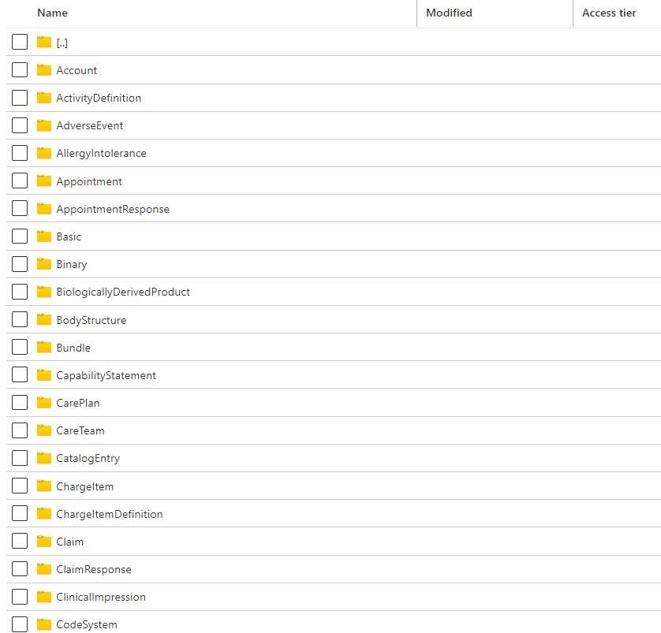

# FHIR to Synapse Sync Agent

FHIR to Synapse Sync Agent enables you to perform Analytics and Machine Learning on FHIR data by moving FHIR data to Azure Data Lake in near real time and making it available to a Synapse workspace.

It is an Azure Function that extracts data from a FHIR server using FHIR Resource APIs, converts it to hierarchical Parquet files, and writes it to Azure Data Lake in near real time. This solution also contains a script to create External Tables and Views in Synapse Serverless SQL pool pointing to the Parquet files. For more information about External Tables and Views, see [Data mapping from FHIR to Synapse](Data-Mapping.md).

This solution enables you to query against the entire FHIR data with tools such as Synapse Studio, SSMS, and Power BI. You can also access the Parquet files directly from a Synapse Spark pool. You should consider this solution if you want to access all of your FHIR data in near real time, and want to defer custom transformation to downstream systems.

**Note**: An API usage charge will be incurred in the FHIR server if you use this tool to copy data from the FHIR server to Azure Data Lake.

## Deployment

### Prerequisites

- An instance of Azure API for FHIR, FHIR server for Azure, or the FHIR service in Azure Healthcare APIs. The pipeline will sync data from this FHIR server.
- A Synapse workspace.

### Steps at high level

1. Deploy the pipeline using the given ARM template.
1. Provide access of the FHIR service to the Azure Function that was deployed in the previous step.
1. Verify that the data gets copied to the Storage Account. If data is copied to the Storage Account, then the pipeline is working successfully.
1. Provide access of the Storage Account and the Synapse workspace to your account for running the PowerScript mentioned below.
1. Provide access of the Storage Account to the Synapse Workspace to access the data from Synapse.
1. Run the provided PowerShell script that creates following artifacts:
    1. Resource specific folders in the Azure Storage Account.
    1. A database in Synapse serverless pool with External Tables and Views pointing to the files in the Storage Account.
1. Query data from Synapse Studio.

### 1. Deploy the pipeline

1. To deploy the FHIR Synapse sync pipeline, use the buttons below to deploy through the Azure Portal.
   
    <a href="https://portal.azure.com/#create/Microsoft.Template/uri/https%3A%2F%2Fraw.githubusercontent.com%2FMicrosoft%2FFHIR-Analytics-Pipelines%2Fmain%2FFhirToDataLake%2Fdeploy%2Ftemplates%2FFhirSynapsePipelineTemplate.json" target="_blank">
        
    </a>

    Or you can browse to the [Custom deployment](https://ms.portal.Azure.com/#create/Microsoft.Template) page in the Azure portal, select **Build your own template in the editor**, then copy the content of the provided [ARM template](../deploy/templates/FhirSynapsePipelineTemplate.json) to the edit box and click **Save**.

    The deployment page should open the following form. 
    
    

2. Fill the form based on the table below and click on **Review and Create** to start the deployment.

    |Parameter   | Description   |
    |---|---|
    | Resource Group | Name of the resource group where you want the pipeline related resources to be created. |
    | App Name  | A name for the Azure Function.  |
    | Fhir server Url  | The URL of the FHIR server. If the baseUri has relative parts (like http://www.example.org/r4), then the relative part must be terminated with a slash, (like http://www.example.org/r4/). |
    | Authentication  |  Whether to access the FHIR server with managed identity authentication. Set it to false if you are using an instance of the FHIR server for Azure with public access. |
    | Fhir version | Version of the FHIR server. Currently only R4 is supported. |
    | Data Start | Start time stamp of the data to be exported. |
    | Data End | Start time stamp of the data to be exported. Leave it empty if you want to periodically export data in real time.  |
    | Container name | A name for the Storage Account container to which Parquet files will be written. The Storage Account with autogenerated name will automatically be created during the installation. |
    | Package url | The build package of the agent. You need not change this. |
    | App Insight Location | You can find logs in the deployed application insight resource. You need not change this. |

3. Ensure to make note of the names of the _Storage Account_ and the _Azure Function App_ created during the deployment.


### 2. Provide Access of the FHIR server to the Azure Function

If you are using the Azure API for FHIR or the FHIR service in Azure Healthcare APIs, assign the **FHIR Data Reader** role to the Azure Function noted above.

If you are using the FHIR server for Azure with anonymous access, then you can skip this step.

### 3. Verify data movement

The Azure Function app deployed previously runs automatically. You'll notice the progress of the Azure Function in the Azure portal. The time taken to write the data to the storage account depends on the amount of data in the FHIR server. After the Azure Function execution is completed, you should have Parquet files in the Storage Account. Browse to the _results_ folder inside the container. You should see folders corresponding to different FHIR resources. Note that you will see folders for only those Resources that are present in your FHIR server. Running the PowerShell script described further below will create folders for other Resources.



### 4. Provide privilege to your account

You must provide the following roles to your account to run the PowerShell script in the next step. You may revoke these roles after the installation is complete.

1. In your Synapse workspace, select **Synapse Studio > Manage > Access Control**, and then provide the _Synapse Administrator_ role to your account.
1. In the Storage Account created during the pipeline installation, select the **Access Control (IAM)** and assign the _Storage Blob Data Contributor_ role to your account.

### 5. Provide access of the Storage Account to the Synapse Workspace

To enable Synapse to read the data from the Storage Account, assign the _Storage Blob Data Contributor_ role to it. You can do this by selecting **Managed identify** while adding members to the role. You should be able to pick your Synapse workspace instance from the list of managed identities shown on the portal.

### 6. Run the PowerShell script

Running the PowerShell script that creates following artifacts:

1. Resource specific folders in the Azure Storage Account.
1. A database in Synapse [serverless SQL pool](https://docs.microsoft.com/en-us/azure/synapse-analytics/sql/on-demand-workspace-overview) with [External Tables](https://docs.microsoft.com/en-us/azure/synapse-analytics/sql/develop-tables-external-tables?tabs=hadoop) and [Views](https://docs.microsoft.com/en-us/azure/synapse-analytics/sql/create-use-views) pointing to the files in the Storage Account.

To run the PowerShell Script, perform the following steps:

1. Clone this [FHIR-Analytics-Pipelines](https://github.com/microsoft/FHIR-Analytics-Pipelines) repo to your local machine.
1. Open the PowerShell console, ensure that you have the latest version of the PowerShell.
1. Install [Az](https://docs.microsoft.com/en-us/powershell/azure/install-az-ps?view=azps-7.1.0) or separated [Az.Synapse](https://docs.microsoft.com/en-us/cli/azure/synapse?view=azure-cli-latest) if they don't exist.
    ``` PowerShell
    Install-Module -Name Az
    Install-Module -Name Az.Synapse
    ```
1. Sign in to your Azure account to the subscription where synapse is located.
    ``` PowerShell
    Connect-AzAccount -SubscriptionId 'yyyy-yyyy-yyyy-yyyy'
    ```
1. Browse to the scripts folder under this path (..\FhirToDataLake\scripts).
1. Run the following PowerShell script. 
    ```Powershell
    ./Set-SynapseEnvironment.ps1 -SynapseWorkspaceName "{Name of your Synapse workspace instance}" -StorageName "{Name of your storage account where Parquet files are written}".
    ```
    For more details, refer to the complete syntax below.
    ``` PowerShell
    Set-SynapseEnvironment
        [-SynapseWorkspaceName] <string>
        [-StorageName] <string>
        [[-Database] <string>, default: “fhirdb”]
        [[-Container] <string>, default: “fhir”]
        [[-ResultPath] <string>, default: “result”]
        [[-MasterKey] <string>, default: ”FhirSynapseLink0!”]
        [[-Concurrent] <int>, default: 30]
    ```

    |Parameter   | Description   |
    |---|---|
    | SynapseWorkspaceName | Name of Synapse workspace instance. |
    | StorageName | Name of Storage Account where parquet files are stored. |
    | Database | Name of database to be created on Synapse serverless SQL pool |
    | Container | Name of container on storage where parquet files are stored. |
    | ResultPath | Path to the parquet folder. |
    | MasterKey | Master key that will be set in the created database. The database needs to have the master key, and then you can create EXTERNAL TABLEs and VIEWs on it. |
    | Concurrent | Max concurrent tasks number that will be used to upload place holder files and execute SQL scripts. |

### 7. Query data from Synapse Studio

Go to your Synapse workspace serverless SQL pool. You should see a new database named _fhirdb_. Expand _External Tables_ and _Views_ to see the entities. Your FHIR data is now ready to be queried.

As you add more data to the FHIR server, it will be fetched automatically to the Data Lake and become available for querying.
