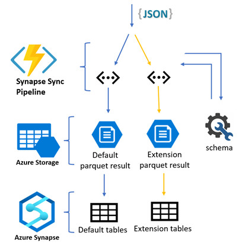
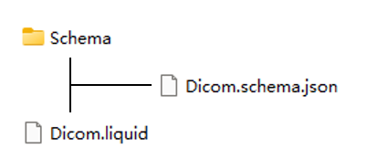
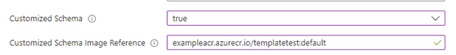
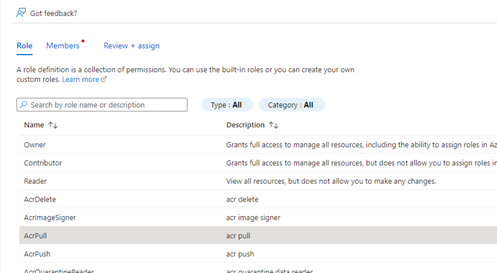
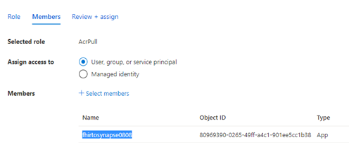
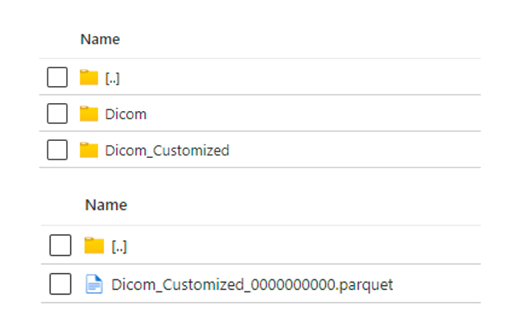
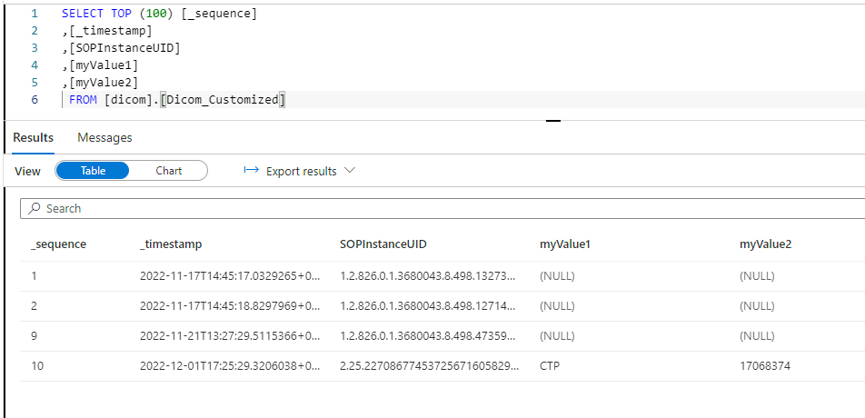

# Customized Schema For DICOM To Data Lake

 

## Generate parquet data for DICOM customized tags

### 1.	Prepare the customized schema templates
You need to prepare a **liquid template** and a related **JSON schema** file. 

- The liquid template will be used to convert the raw DICOM JSON metadata into target structure.
- The JSON schema will be used to generate the Parquet schema and create table definitions.

Follow the links for more information about [liquid template](http://dotliquidmarkup.org/) and [JSON schema](https://json-schema.org/learn/getting-started-step-by-step).

Below are the example liquid template and JSON schema, select "00080018", "00130010", "00131013" value from DICOM metadata and represent them as "SOPInstanceUID", "myValue1", "myValue2" in result Parquet data.

_Liquid template:_
```liquid

{
    "_sequence": "{{ msg._sequence }}",
    "_timestamp": "{{ msg._timestamp }}",
    "SOPInstanceUID": "{{ msg.00080018.Value | first }}",
    "myValue1": "{{ msg.00130010.Value | first }}",
    "myValue2": "{{ msg.00131013.Value | first }}",
}

```

_JSON schema file:_

```javascript
{
    "title": "DICOM customized schema",
    "type": "object",
    "properties": {
        "_sequence": { "type": "string" },
        "_timestamp": { "type": "string" },
        "SOPInstanceUID": { "type": "string" },
        "myValue1": { "type": "string" },
        "myValue2": { "type": "string" }
    },
    "required": [ "SOPInstanceUID" ]
}
```

**Note**:
1. The JSON schema files must be saved at **Schema** directory in the image.
	 
	 

2. A JSON schema file  **"Dicom.schema.json"**.

3. A liquid template **"Dicom.liquid"**

4. The "validate" tag in template is optional and we recommend using it in your liquid template.

5. We internally leverage the [FHIR-Converter](https://github.com/microsoft/FHIR-Converter) to convert the DICOM metadata. You can test your templates and schema file with it before deploying the analytics pipeline.

### 2.	Push the customized schema to Azure Container Registry
Refer [here](https://github.com/microsoft/FHIR-Converter/blob/main/docs/TemplateManagementCLI.md) to push the prepared schema to Azure Container Registry, later we will use the schema image reference from the Container Registry to deploy the analytics pipeline.

### 3.	Deploy the Analytics pipeline with customized schema enabled

Use the button below to deploy  the pipeline with [ARM template](https://github.com/microsoft/FHIR-Analytics-Pipelines/blob/main/FhirToDataLake/deploy/templates/FhirSynapsePipelineTemplate.json) through the Azure Portal.
   
<a href="https://portal.azure.com/#create/Microsoft.Template/uri/https%3A%2F%2Fraw.githubusercontent.com%2FMicrosoft%2FFHIR-Analytics-Pipelines%2Fmain%2FFhirToDataLake%2Fdeploy%2Ftemplates%2FContainerApp%2FDeployDicomPipelineToContainerApp.json" target="_blank">
    
</a>

Set the parameter "Customized Schema" as "true", and "Customized Schema Image Reference" as the reference of image where your schema is stored.

 

After deploying the pipeline, the Azure Container Apps agent will try to pull the customized schema from the given image reference.

### 4.	Provide access of the Container Registry to the Azure Container Apps
Go to the Azure Container Registry instance, assign **“AcrPull”** role to **principal account** of your created Azure Container Apps.
 
 

 


### 5.	Verify customized data on the Storage

Customized data will be generated to "Dicom_Customized" folder on the Storage.

_Example customized DICOM Parquet format metadata on the Storage_

 

## Query customized data in Synapse Serverless SQL pool

### 1.	Run the Powershell script to create the tables and views with customized schema image

Browse to the scripts folder under this path (..\FhirToDataLake\scripts).

Run the following PowerShell script.

```Powershell
./Set-SynapseEnvironment.ps1 -SynapseWorkspaceName "Synapse name" -StorageName "Storage name" -CustomizedSchemaImage "Schema image reference" -Container dicom -Database dicomdb -DataSourceType DICOM
```

_Example:_

```./Set-SynapseEnvironment.ps1 -SynapseWorkspaceName examplesynapse -StorageName examplestorage -CustomizedSchemaImage exampleacr.azurecr.io/customizedtemplate:extensiontemplates  -Container dicom -Database dicomdb -DataSourceType DICOM```

### 2.	Query customized data in Synapse SQL pool

 
