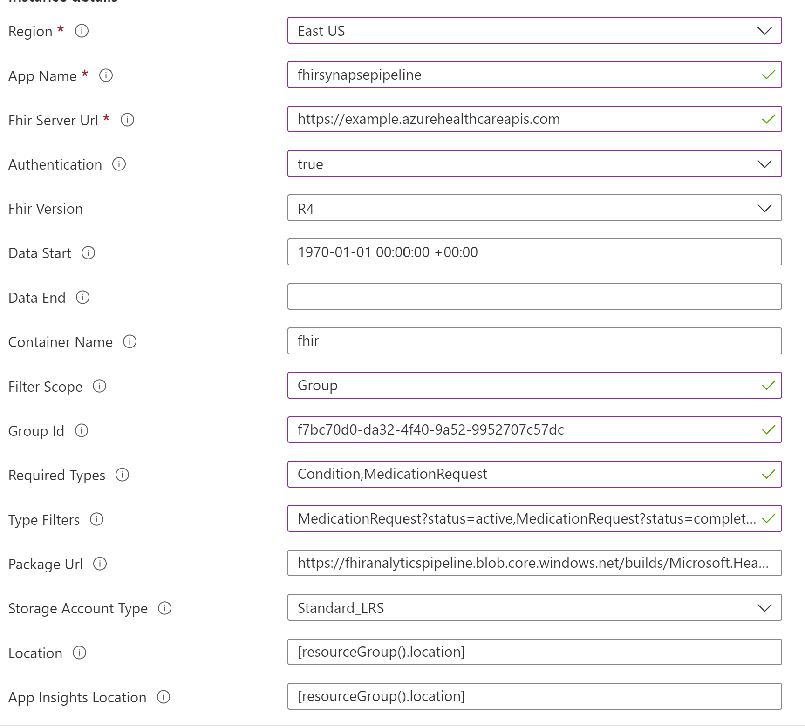

# Filter FHIR data in pipeline 

Currently the pipeline supports exporting FHIR data at 2 different scopes:

1. [System](https://hl7.org/Fhir/uv/bulkdata/export/index.html#endpoint---system-level-export): All resources will be exported.
2. [Group](https://hl7.org/Fhir/uv/bulkdata/export/index.html#endpoint---group-of-patients): Patients and associated resources for a particular group resource will be exported. 

Furthermore, you can filter data at a more fine-grained level by specifying parameters `type`, `typeFilter`. The type and typeFilter parameters work similarly as 
[FHIR export](https://build.fhir.org/ig/HL7/bulk-data/export.html).

| Parameter | Type | Example | Description |
| --- | --- | --- | --- |
| `type` | string of comma-delimited FHIR resource types | "Condition,MedicationRequest" | Only resources of the specified resource types(s) will be included in the response. |
| `typeFilter` | string of comma delimited FHIR REST queries | "MedicationRequest?status=active,<br>MedicationRequest?status=completed&date=gt2018-07-01T00:00:00Z" | The `typeFilter` parameter should be used along with the `type` parameter to further restrict the results. |

## Sample

Following is a sample configuration of a user request to export patient compartment data in a group with a specified groupId.

It requests for `MedicationRequest` and `Condition` resources, where the user would further like to restrict `MedicationRequests` to requests that are `active,` or else `completed` after July 1, 2018.

``` json
{
    "filtering": {
      "scope": "Group",
      "groupId": "f7bc70d0-da32-4f40-9a52-9952707c57db",
      "type": "Condition,MedicationRequest",
      "typeFilter": "MedicationRequest?status=active,MedicationRequest?status=completed&date=gt2018-07-01T00:00:00Z"
    }
}
```

>Note:

>1. The `Condition` resources is included in `type` but omitted from `typeFilter` because the user intends to request all `Condition` resources without any filters.
>2. There are two filters for `MedicationRequest`, we will process them separately and merge the result.

Here are some additional notes on `type` and `typeFilter`:

1. If this `type` parameter is omitted, will return all supported resources.
   - For system scope, all the FHIR resource types will be returned; 
   - For group scope, all the patient compartment resource types will be returned.
  
2. If a resource type is listed in `type` without `typeFilter`, all resources will be included in the output.

3. For resource type with multiple type filters, the data will be processed separately and the results will be merged.

   There might be overlap between the output results and currently de-duplication **is not supported**. You need to carefully configure the `typeFilter` to avoid overlap in output result.

4. To only specify the parameter `typeFilter` but not `type` **is not allowed.** Error will be thrown during the parameter validation phase.

5. For group scope, when `Patient` resource is not in the `type`, we will still process all compartment resources but not returning the patient resources.

## Sample deployment template

Below is a sample deployment template after specifying the parameters for filtering. 

