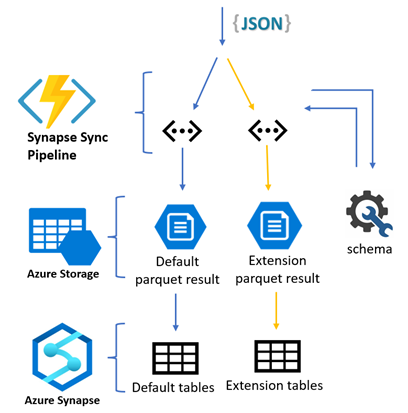
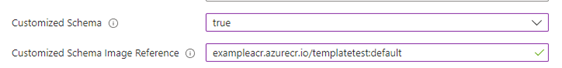
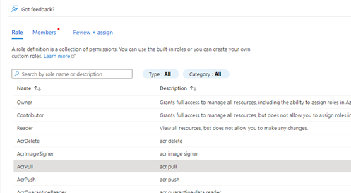

# Process FHIR extensions  

 

## Generate parquet data for FHIR extensions

### 1.	Prepare the customized schema templates
For each resource types, e.g. Patient, Observation, you need to prepare a **liquid template** and a related **JSON schema** file. 

- The liquid template will be used to convert the raw FHIR JSON data into target structure.
- The JSON schema will be used to generate the Parquet schema and create table definitions.

Follow the links for more information about [liquid template](http://dotliquidmarkup.org/) and [JSON schema](https://json-schema.org/learn/getting-started-step-by-step).

Below are the example liquid template and JSON schema for "Patient" resource, flatten the [Patient birthPlace](https://build.fhir.org/extension-patient-birthplace.html) extension for analytics.

_Liquid template:_
```liquid

{
"resourceType": "{{ msg.resourceType }}",
"id": "{{ msg.id }}",


"birthPlaceExtension.valueAddress.city": "{{ birth_place_extension.valueAddress.city }}",
"birthPlaceExtension.valueAddress.state": "{{ birth_place_extension.valueAddress.state }}",
"birthPlaceExtension.valueAddress.country": "{{ birth_place_extension.valueAddress.country }}",
"birthPlaceExtension.valueAddress.postalCode": "{{ birth_place_extension.valueAddress.postalCode }}",
}


```

_JSON schema file:_

```javascript
{
    "title": "Patient customized schema",
    "type": "object",
    "properties": {
        "resourceType": { type": "string" },
        "id": { "type": "string" },
	"birthPlaceExtension.valueAddress.city": { type": "string" },
	"birthPlaceExtension.valueAddress.state": { "type": "string" },
	"birthPlaceExtension.valueAddress.country": { "type": "string" },
	"birthPlaceExtension.valueAddress.postalCode": { "type": "string" }
    },
    "required": [ "id" ]
}
```

**Note**:
1.	The JSON schema files must be saved at **Schema** directory in the image.
	 
	 

1.  The JSON schema files need to have suffix **".schema.json"**.

2.  The liquid templates and JSON schema files name should be aligned with resource type name. 
   
    E.g. "```Patient.schema.json```" and "```Patient.liquid```" be used to process the "Patient" resource.

4.	The "validate" tag in template is optional and we recommend using it in your liquid template.
5.	We internally leverage the [FHIR-Converter](https://github.com/microsoft/FHIR-Converter) to convert the raw FHIR data. You can test your templates and schema files with it before deploying the analytics pipeline.

### 2.	Push the customized schema to Azure Container Registry
Refer [here](https://github.com/microsoft/FHIR-Converter/blob/main/docs/TemplateManagementCLI.md) to push the prepared schema to Azure Container Registry, later we will use the schema image reference from the Container Registry to deploy the analytics pipeline.

### 3.	Deploy the Analytics pipeline with customized schema enabled
Deploy the pipeline with [ARM template](https://github.com/microsoft/FHIR-Analytics-Pipelines/blob/main/FhirToDataLake/deploy/templates/FhirSynapsePipelineTemplate.json), set the parameter “Customized Schema” as “true”, and “Customized Schema Image Reference” as the reference of image where your schema is stored.

 

After deploying the pipeline, the Azure Function agent will try to pull the customized schema from the given image reference.

### 4.	Provide access of the Container Registry to the Azure Function
Go to the Azure Container Registry instance, assign **“AcrPull”** role to **principal account** of your created Azure Function.
 
 

 


### 5.	Verify customized data on the Storage

Customized data will be generated to “{resource type}_Customized” folder on the Storage.

_Example customized patient Parquet data on the Storage_

 

 

## Query customized data in Synapse Serverless SQL pool

### 1.	Run the Powershell script to create the tables and views with customized schema image

Browse to the scripts folder under this path (..\FhirToDataLake\scripts).

Run the following PowerShell script.

```
./Set-SynapseEnvironment.ps1 -SynapseWorkspaceName "Synapse name" -Storage "Storage name" -CustomizedSchemaImage "Schema image reference"
```

_Example:_

```./Set-SynapseEnvironment.ps1 -SynapseWorkspaceName examplesynapse -Storage examplestorage -CustomizedSchemaImage exampleacr.azurecr.io/customizedtemplate:extensiontemplates```

### 2.	Query customized data in Synapse SQL pool

 
