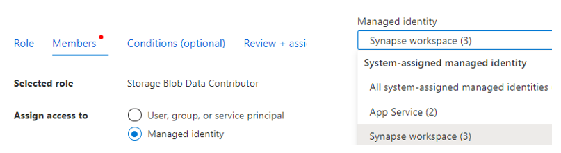
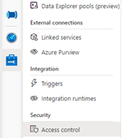

## Creating EXTERNAL TABLEs and VIEWs on Synapse serverless SQL pool

### Requirements
1. An Azure Storage instance, where parquet FHIR data been exported.
2. An Azure Synapse Analytics instance.

#### Access permissions
1. In storage **Access Control (IAM)**, in “**Members**” select “**Managed identity**”, then select “Synapse workspace” in “Managed identity”, add your Synapse workspace as the “**Storage Blob Data Contributor**” role.
   
    

2. (Required for PowerShell script) In **Synapse Studio** -> **Manage** -> **Access Control**, add your Azure account as the “**Synapse Administrator**” role. 
   
    

3. (Required for PowerShell script) In storage **Access Control(IAM)**, in “**Members**” select “**User, group, or service principal**”, add your Azure account as the “**Storage Blob Data Contributor**” role.

### Run PowerShell script to create EXTERNAL TABLEs/VIEWs for all resource types.

The script [**Set-SynapseEnvironment.ps1**](../scripts/Set-SynapseEnvironment.ps1) can help to create EXTERNAL TABLEs and VIEWs on Synapse that pointing to parquet FHIR data files in storage.

#### Requirement
1. PowerShell [Az](https://docs.microsoft.com/en-us/powershell/azure/install-az-ps?view=azps-6.6.0) and [SqlServer](https://docs.microsoft.com/en-us/powershell/module/sqlserver/?view=sqlserver-ps) modules.

#### Run: 
1. Open powershell terminal and go to the scripts directory. 

    ```Powershell
    cd scripts
    ```

2. login to your account by command: 

    ```Powershell
    Connect-AzAccount 
    ```

3. Run script by command like: 

    ```Powershell
    ./Set-SynapseEnvironment.ps1 -SqlServerEndpoint "{Your Synapse serverless SQL pool endpoint}" -Storage "{Your storage name where parquet FHIR data be exported to}" 
    ```
    
      Example: ```./Set-SynapseEnvironment.ps1 -SqlServerEndpoint "example-ondemand.sql.azuresynapse.net" -Storage "examplestorage" ```

Then you can directly analysis your FHIR data in Synapse. 

#### Syntax
```Powershell
Set-SynapseEnvironment
  [-SqlServerEndpoint] <string>
  [-Storage] <string> 
  [[-Database] <string>, default: “fhirdb”] 
  [[-Container] <string>, default: “fhir”]
  [[-ResultPath] <string>, default: “result”]
  [[-MasterKey] <string>, default: ”FhirSynapseLink0!”]
  [[-Concurrent] <int>, default: 25]
```

The script will do 3 things: 

1. Upload hidden readme files to Storage, act as the "placeholder" files so that Synapse can list folder in storage to create VIEWs.
2. Create a new database on Synapse serverless SQL pool, and initialize its environment for later steps. E.g. creating data sources, creating storage credential, creating data format.
3. Create EXTERNAL TABLEs and VIEWs by executing SQL scripts in “scripts/sql/resources” directory. 

For cleaning up, the script will try to drop the database (when successfully created) if fail to create EXTERNAL TABLEs and VIEWs.

#### Parameters

##### -SqlServerEndpoint
Synapse serverless SQL pool endpoint. E.g. “example-ondemand.sql.azuresynapse.net“

##### -Storage
Name of storage where parquet FHIR data be exported to.

##### -Database
Naem of database to be created on Synapse serverless SQL pool

##### -Container
Name of container on storage where parquet FHIR data be exported to.

##### -ResultPath
Path to the parquet FHIR data.

##### -MasterKey
Master key that will be set in created database. Database need to have master key then we can create EXTERNAL TABLEs and VIEWs on it.

##### -Concurrent
Max concurrent tasks number that will be used to upload readme files and execute SQL scripts.


### Manually create EXTERNAL TABLEs/VIEWs on Synapse serverless SQL pool.

1. Create a new serverless database.
   
```SQL
CREATE DATABASE {Your_database_name}
```

2. Initialize Synapse environments.

```SQL
CREATE MASTER KEY ENCRYPTION BY PASSWORD = '{Your_master_key}';

CREATE DATABASE SCOPED CREDENTIAL SynapseIdentity
WITH IDENTITY = 'Managed Identity';

CREATE EXTERNAL DATA SOURCE ParquetSource WITH (
    LOCATION = 'https://{Your_storage_name}.blob.core.windows.net/$container/{Parquet_files_folder_path}',
    CREDENTIAL = SynapseIdentity
);

CREATE EXTERNAL FILE FORMAT ParquetFormat WITH (  FORMAT_TYPE = PARQUET );

GO
CREATE SCHEMA fhir;

GO
USE [master]
```

3. Create EXTERNAL TABLES/VIEWs.

    Refer to SQL scripts in "**scripts/sql/resources**" to create EXTERNAL TABLEs/VIEWs for different resource types.

    [All_TABLEs_VIEWs.sql](../scripts/sql/All_TABLEs_VIEWs.sql) contains summary of SQL language to create EXTERNAL TABLEs/VIEWs for all resource types.