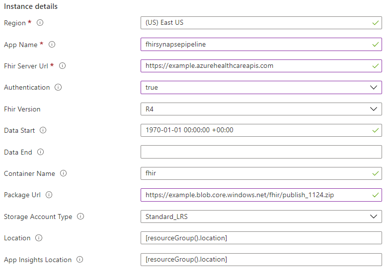
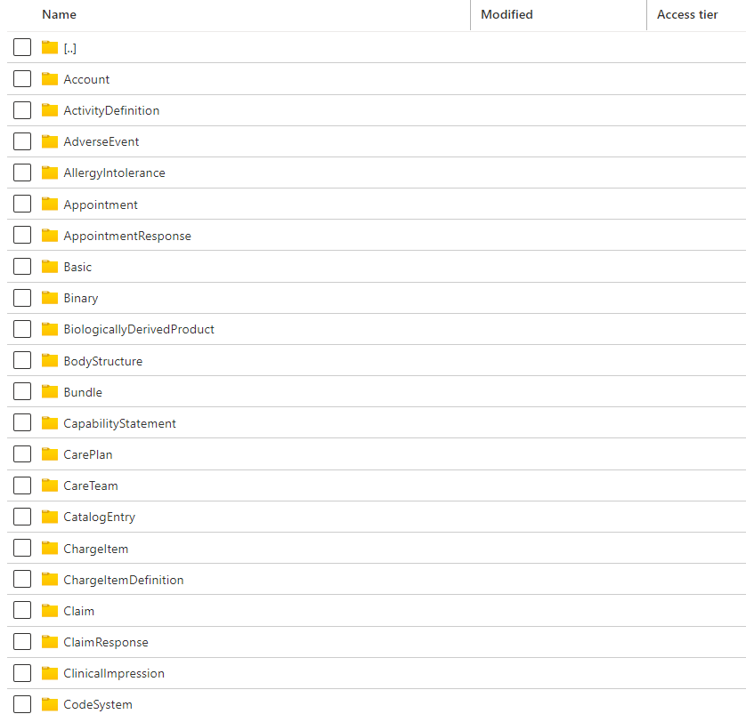

### Preparations
To deploy and run the FHIR analytics pipeline agent, you will need a FHIR server instance (suggest testing with OSS instance without authentication. For paas instances, make sure you have premission to assign the Managed Identity authentication).

### Deployment
1. Go to [Custom deployment](https://ms.portal.azure.com/#create/Microsoft.Template) on Azure, them select **Build your own template in the editor**.
2. Use provided [template](../deploy/templates/FhirSynapseLinkTemplate.json) to deploy an analytics pipeline.

Parameters:
- **App Name**: azure function name.
- **Fhir Server Url**: fhir service endpoint. Managed FHIR service is recommended. You can try test with your PaaS fhir server.
- **Authentication**: whether to access Azure API for FHIR with managed identity authentication. Set false if you are using an OSS public FHIR server instance.
- **Fhir version**: currently R4 is supported.
- **Data Start**: start time stamp to export the data.
- **Data End**: End timestamp to export the data, leave it empty if you want to periodically export data in real time.
- **Container name**: container in azure storage to store results. The Azure storage will be created by the arm template. You can find the output after deploy completes.
- **Package url**: the build package of the agent.
- **App Insight Location**: you can find logs in the deployed application insight resource.

### Test
The agent will run automatically after deployment. You can find the data written to the target container on azure storage.

Now you can try run our script to set up your synapse workspace and explore the data. 
