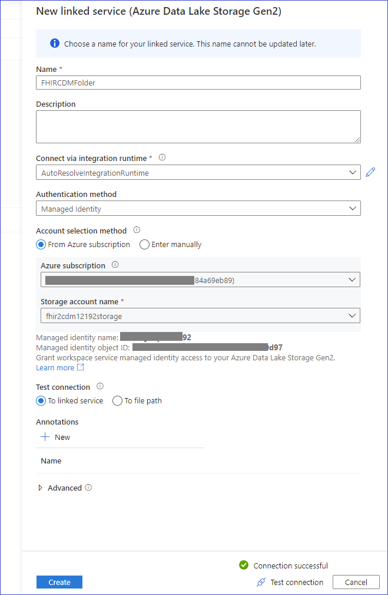
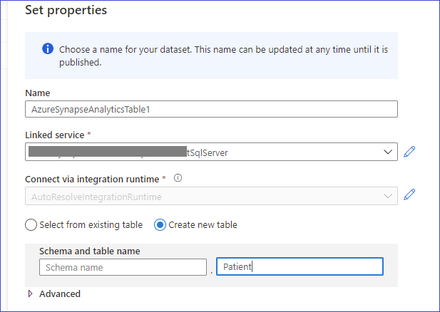

## Moving data from CDM folder to Azure Synapse

### Prerequisite
1. A Synapse workspace. [Create](https://ms.portal.azure.com/#create/Microsoft.Synapse) one if you need. 
1. Managed identity enabled on the Synapse workspace
1. The managed identify has Synapse SQL Administrator role. Navigate to Synapse Studio >> Manage >> Access Control to verify. If needed, provide access.
1. Database master key is created on the Synapse SQL pool. Refer the [documentation](https://docs.microsoft.com/en-us/sql/t-sql/statements/create-master-key-transact-sql?view=sql-server-ver15). 
1. Pipelines are allowed to access SQL Pools. This is the default setting in Synapse.

### Create pipeline

1. Open Synapse Studio. Go to Integrate => + => Pipeline. Provide details.

2. Create source in Data Flow Activity. Choose "Common Data Model" for source type. Click _New_ to create a new Linked service.

3. Select the storage that contains the CDM folders with FHIR data. Use _Managed Identity_ authentication method. Provide _Storage Blob Data Reader_ access for the storage to the managed identity name. Test the connection.

4. Under _Source options_ configure the _Root location_ to the CDM container name, and _Entity_ to the table name under CDM folder that you want to copy data from. If you enable debugging you can use Browse button to see the available entities.

5. Click on _Import Schema_ under _Projection_ tab. It will import the table schema from the CDM folder.

6. Create sink. 

7. Click on _New_ against the dataset to create a new dataset of type _Azure Synapse Analytics_. Set properties, and provide name for a new Table.

8. Go to the dataflow activity and fill-in the Staging linked service under Settings tab.

9. Publish and trigger the pipeline. Once the pipeline has run successfully, you can see the data in the table by connecting SQL Server Management Studio.